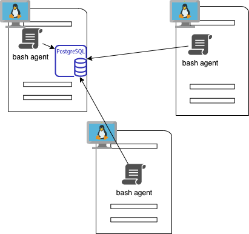

# Linux Cluster Monitoring Agent

## Introduction

The Cluster Monitoring Agent is a tool used to record hardware specifications and to monitor resource usage of all Linux nodes in a cluster.
A PostgreSQL database installed one of these nodes will store all this information The hardware specification information will be collected only once while the resource usage information will be collected at a specified interval.

## Architecture and Design

The diagram below shows a cluster of three nodes with the Cluster Monitoring Agent installed in them.


In the database, server information and usage data are stored in two tables: `host_info` and `host_usage` respectively.

`psql_docker.sh` is a bash script that can be used to start or stop the Docker and PostgreSQL software required for the other scripts.

`ddl.sql` sets up the PostgreSQL database.

The bash agent runs two scripts: `host_info.sh` and `host_usage.sh`.

`host_info.sh` is a script that should be run after each hardware update. It records the hardware specifications of the server, which is then sent to the central database and recorded in the table `host_info`.

`host_usage.sh` is a script that is scheduled to run at a specified interval. It records the server's resource usage in the table `host_usage`.

## Usage

1. `psql_docker.sh`:
   - starts: `./psql_docker.sh start`
   - stops: `./psql_docker.sh stop`
   - creates psql docker container with the given username and password.: `./psql_docker.sh create [username] [password]`
2. `ddl.sql`: to set up the database, use the below command.
   - `psql -h localhost -U postgres -d host_agent -f ddl.sql`
3. `host_info.sh`: used to collect server hardware information and to store it in the databaseand executed using the following command.
   - `./host_info.sh [host name] [database name] [username] [password]`
4. `host_usage.sh`: used to collect server data regarding its memory and CPU usage and executed using the following command.

   - `./host_usage.sh [hostname] [database name] [username] [password]`

5. `crontab`: In order to schedule `host_usage.sh` to execute at a specified interval (examples below for one minute and respectively five minutes), usecrontab (command `crontab -e`).
   ```
   * * * * * * bash [server's local pathway]/host_usage.sh localhost 5432 host_agent postgres password > /tmp/host_usage.log
   ```
   ```
   */5 * * * * bash [server's local pathway]/host_usage.sh localhost 5432 host_agent postgres password > /tmp/host_usage.log
   ```

## Improvements

1. Script to display the usage information stored in the database:
   default: display information for all the nodes for the past 60 minutes
   options could be: hostname, past X minutes|hours|days, time interval for current day, interval that spans multiple days;
2. Automatically send an e-mail with reports based on set parameters;
3. Automatically send an email and sms with critical usage information based on set parameters;
4. Script to archive data;
5. New query to compare usage per hardware update.
